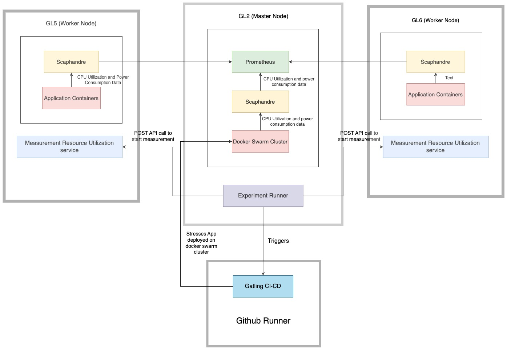

# BookStoreApp-Distributed-Application

## About this project
This is an Ecommerce project where users can adds books to the cart and buy those books.

## Architecture
All the Microservices are developed using spring boot. 
This spring boot applications will be registered with eureka discovery server.

FrontEnd React App makes request's to NGINX server which acts as a reverse proxy.
NGINX server redirects the requests to Zuul API Gateway. 

Zuul will route the requests to microservice
based on the url route. Zuul also registers with eureka and gets the ip/domain from eureka for microservice while routing the request. 

## Run front-end app

Navigate to `bookstore-frontend-react-app` folder
Run below commnads to start Frontend React Application

```bash
yarn install
yarn start
```

## Build all microservice Jars
Run `mvn clean install` at root of project to build all the microservices jars.


## Run this project using Docker Swarm

Follow the [tutorial](https://docs.docker.com/engine/swarm/swarm-tutorial/create-swarm/) for setting up Docker Swarm on your cluster.

### Demo deployment
Run `deploy.sh` to automatically deploy the stack.

You can specify the compose file to be used and the name of the stack as follows:
`deploy.sh -n <name_of_stack> -c <compose_file>`

### Manual deployment

Create network: `docker network create --driver overlay bookstore-app-network`

Run `docker service create --name registry --publish published=5000,target=5000 registry:2` to create a disposable registry for the docker images.

Run `docker compose build` to build all the images.

Run `docker compose push` to push all the generated images to the local repository.

Run `docker stack deploy --with-registry-auth -c docker-compose.yml <name_of_stack>` to deploy the stack.

In order for telegraf to be able to read information from influxDB, you need to modify the docker GID accordingly in the `docker-compose.yml` file under the `bookstore-telegraf` configuration (specifically, `user: telegraf:<GID>`).

## Remove the stack from your swarm cluster

Bring stack down: `docker stack rm <name_of_stack>`

Remove local repository: `docker service rm registry`

>

### Service Discovery
This project uses Eureka or Consul as Discovery service.

While running services in local, then using eureka as service discovery.

While running using docker, consul is the service discovery. 

Reason to use Consul is it has better features and support compared to Eureka. Running services individually in local uses Eureka as service discovery because dont want to run consul agent and set it up as it becomes extra overhead to manage. Since docker-compose manages all consul stuff hence using Consul while running services in docker.

## TICK stack monitoring.

TICK(Telegraf, InfluxDB, Chronograf, Kapacitor) This setup is getting more attention due to its push and pull model. InfluxDB is a time series database, bookstore services push the metrics to influxDB(push model), In Telegraf we specify the targets to pull metrics(pull model). Chronograf/Graphana can be used to view the graph/charts. Kapacitor is used to configure rules for alarms.

Deploying with `docker-compose.yml` will take care of bringing all this monitoring containers up.

## Port Configurations

### Business Logic
| Service    | Port |
| --------   | -----|
| Account    | 4001 |
| Billing    | 5001 |
| Catalog    | 6001 |
| Order      | 7001 |
| Payment    | 8001 |

### Administrative
| Service    | Port |
| --------   | -----|
| MySQL      | 3306 |
| Consul     | 8500 |
| Zuul       | 8765 |
| Telegraf   | 8125 |
| Zipkin     | 9411 |
| InfluxDB   | 8086 |
| Chronograf | 8888 |
| Kapacitor  | 9092 |


> Account Service

To Get `access_token` for the user, you need `clientId` and `clientSecret`

```
clientId : '93ed453e-b7ac-4192-a6d4-c45fae0d99ac'
clientSecret : 'client.devd123'
```

There are 2 users in the system currently. 
ADMIN, NORMAL USER

```
Admin 
userName: 'admin.admin'
password: 'admin.devd123'
```

```
Normal User 
userName: 'devd.cores'
password: 'cores.devd123'
```

*To get the accessToken (Admin User)* 

```curl 93ed453e-b7ac-4192-a6d4-c45fae0d99ac:client.devd123@localhost:4001/oauth/token -d grant_type=password -d username=admin.admin -d password=admin.devd123```

### Experiment Runner Block Diagram


### Stress Testing the Bookstore Application using experiment runner

This document outlines the procedure to run a stress test experiment on the Bookstore application deployed on a Docker Swarm cluster.

## Prerequisites
- Ensure you have access to the manager node of your Docker Swarm cluster.
- The Bookstore application repository must be cloned in the home directory.
- Python 3 should be installed on the manager node.

## Running the Experiment

To run the experiment, follow these steps in sequence:

```sh
# Step 1: SSH into the Manager Node
ssh ishas@145.108.225.7

# Step 2: Clone the Bookstore Repository (If Not Already Cloned)
git clone https://github.com/ishaskul/bookstore.git

# Step 3: Navigate to the Project Directory
cd bookstore

# Step 4: Navigate to the Load Testing Folder
cd load_test_experiment

# Step 5: Run the Experiment
nohup python3 run_experiment.py --app bookstore \
    --scenario bookstore.BuyBooksSimulation \
    --ramp_up_duration 240 \
    --no_of_users 3500 \
    --output_folder ./buy_books_new_run \
    --iterations 10 > experiment.log 2>&1 &
```

### Overview of Replication Package Experiment Runner
This replication package is structured as follows:

```
    /
    .
    |--- ./load_test_experiment/run_experiment.py                                                   Main source code of the experiment runner for triggering Gatling stress test
    |--- ./load_test_experiment/prometheus_queries.json                                             JSON file that contains the prometheus queries to be executed to capture performance metrics such as CPU Util, Power Consumption
    |--- ./load_test_experiment/measure_system_cpu_uttilization.sh                                  Shell script which profiles the system level cpu utilization using SAR package in linux
    |--- ./load_test_experiment/measure_system_power_consumption.sh                                 Shell script which profiles the system level power consumption using Powerstat package in linux
    |--- ./load_test_experiment/buy_books_final                                                     Profiled data that is used as the actual data against which the performance model is validated
    |--- ./measurement_triggering_api/trigger_system_util_measurement.py                            Simple flash server which exposes a POST API to start profiling system level cpu utilization and power consumption
    |--- ./measurement_triggering_api/measure_resource_utilization.service                          A systemd service to trigger system CPU utilization and power consumption measurements for a specified duration.
    |--- ./run_model_and_analysis_scripts.sh                                                        Simple shell script that runs the model and the data analysis scripts to get the prediction plots of the model
```


